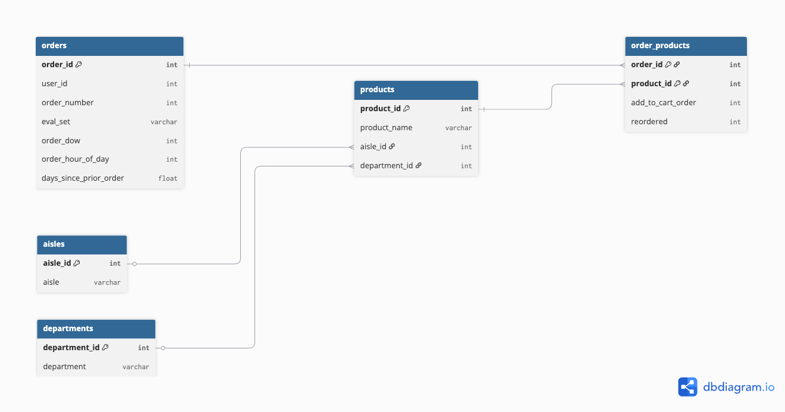
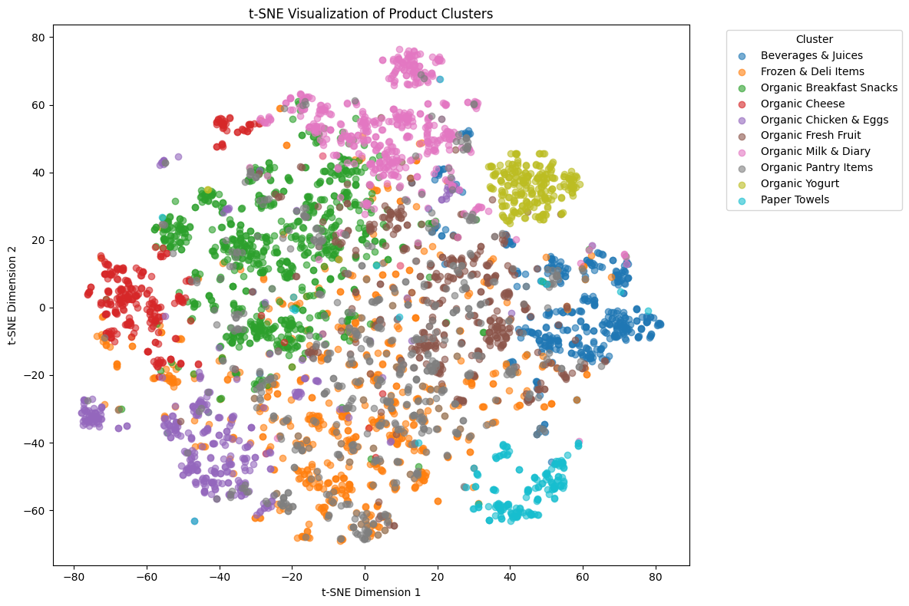

# Instacart Hero Products: Finding the 10% That Drive 80% of Sales
This analysis finds that fewer than 10% of Instacart’s products account for over 80% of both total orders and customer reach — confirming and even exceeding the expectations of the Pareto Principle.  

These **high-performing SKUs** are not only heavily ordered but also widely adopted across the user base, making them critical drivers of Instacart’s business performance. To better understand what makes these products successful, this analysis also designs an LLM-powered system to **explore semantic patterns** that may reveal shared product categories among the top-performing SKUs.

## Project Scope
This project answers the following business questions:
- Does Instacart’s business follow the Pareto Principle?
- If so, are those best-selling products also the most widely adopted across users?
- What are the semantic patterns among top-performing products?  

By analyzing both order volume, user reach and product patterns, this analysis offers a data-driven foundation for targeted product recommendations, inventory prioritization, and marketing strategies.
## Project Roadmap
The steps I will follow are:

- [ ] Define the business objective
- [ ] Understand and prepare the data
- [ ] Measure product and customer contribution
- [ ] Explore semantic patterns among top-performing products
- [ ] Deliver strategic recommendations
## Step 1: Define the Business Objective
### 1.1 What Business Questions can this analysis answer?
This analysis aims to answer the question:  

**"Does Instacart’s business follow the Pareto Principle?"**  
**"If so, are those best-selling products also the most widely adopted across users?"**  
**"Which products make up that top-performing group?"**  

### 1.2 What is the Pareto Principle?
The Pareto Principle, also known as the 80/20 rule, states that roughly 80% of outcomes come from 20% of causes. In business, this often translates to the insight that  

**"80% of product sales come from 20% of the product catalog."**  

This principle helps teams focus their recourses where it matters most – on the few customers and products that drive the majority of value.

### 1.3 How Can Applying the Pareto Principle Benefit Instacart?

Instacart operates in a high-volume, low-margin industry where operational efficiency and strategic focus are key. Applying the Pareto Principle helps uncover the small subset of products that drive the majority of orders and user engagement.

By identifying and prioritizing these high-performing SKUs, Instacart can:

- **Optimize product discovery** by boosting visibility of "hero products" in search results, promotions, and homepage placements  
- **Improve operational efficiency** by focusing inventory, supply chain, and marketing resources on the most impactful items  
- **Enhance customer satisfaction** by understanding and surfacing the products that are both widely adopted and frequently ordered  
- **Inform strategic growth** by analyzing what traits top-performing SKUs share, enabling smarter product expansion and personalization

This analysis not only validates whether the Pareto Principle applies to Instacart’s business, but also translates that insight into practical, high-leverage recommendations.

Roadmap Tracker:
- [x] Define the business objective
- [x] Understand and prepare the data
- [ ] Measure product and customer contribution
- [ ] Explore semantic patterns among top-performing products
- [ ] Deliver strategic recommendations
## Step 2: Understand and Prepare the Data
The Instacart Online Grocery Shopping Dataset 2017 includes a sample of over 3 million grocery orders placed by more than 200,000 Instacart users. The exact time span of the orders is not specified, and it is reasonable to assume that the transactions took place within or around the year of 2017 according to its title.  

It was provided as-is for non-commercial use, and can be downloaded from https://www.instacart.com/datasets/grocery-shopping-2017.
### 2.1 Dataset Description
The full dataset is organized across five key files, capturing customer behavior, order history, and product details.
#### Table: `orders.csv`  (3.4 million rows, 206k users — order-level metadata)

| Column               | Description                                                                 |
|----------------------|-----------------------------------------------------------------------------|
| `order_id` [pk]      | Order identifier                                                            |
| `user_id`            | Customer identifier                                                         |
| `eval_set`           | Evaluation set the order belongs to (`prior`, `train`, or `test`)           |
| `order_number`       | Order sequence number for this user (1 = first, *n* = nth)                  |
| `order_dow`          | Day of the week the order was placed (0 = Saturday)                         |
| `order_hour_of_day`  | Hour of the day the order was placed                                        |
| `days_since_prior`   | Days since the last order (N/A for first orders, capped at 30)              |

---

#### Table: `products.csv` (50k rows — product-level fact data)

| Column             | Description                                  |
|--------------------|----------------------------------------------|
| `product_id` [pk]  | Product identifier                           |
| `product_name`     | Name of the product                          |
| `aisle_id`         | Foreign key to `aisles.csv`                  |
| `department_id`    | Foreign key to `departments.csv`             |

---

#### Table: `aisles.csv` (134 rows — aisle-level fact data)

| Column             | Description           |
|--------------------|-----------------------|
| `aisle_id` [pk]    | Aisle identifier      |
| `aisle_name`       | Name of the aisle     |

---

#### Table: `departments.csv` (21 rows — department-level fact data)

| Column                 | Description             |
|------------------------|-------------------------|
| `department_id` [pk]   | Department identifier   |
| `department`           | Name of the department  |

---

#### Table: `order_products.csv` (32 million rows — order-product join table)

| Column               | Description                                                              |
|----------------------|--------------------------------------------------------------------------|
| `order_id`           | Foreign key to `orders.csv`                                              |
| `product_id`         | Foreign key to `products.csv`                                            |
| `add_to_cart_order`  | Position of the product when added to cart                               |
| `reordered`          | 1 if the user has ordered the product before, 0 otherwise                |

### 2.2 Relational Database Diagram
  
*Figure: Entity-Relationship Diagram of the Instacart dataset, showing table structures and foreign key relationships. Users place multiple orders, each order contains multiple products, and products are classified by aisle and department.*
### 2.3 Define Performance Metrics
To answer the business questions, I must first define what “business performance” means in the context of this dataset.  

In most business settings, performance is measured by revenue or profit margin. However, the Instacart dataset does not include price or revenue data for individual products. Therefore, I thought about the following alternatives as a proxy for business contribution.
1. order frequency: shows total orders per product
2. unique users per product: shows the product’s popularity across customer base
3. reorder count: shows loyalty and habitual use  

In this analysis, I use order frequency as the proxy to identify high-performing SKUs. 
#### 2.4 Data Preparation
To evaluate product performance, this analysis focuses on two key dimensions: **order frequency** and **user reach**. The final schema was designed to capture both how often each product is ordered (`total_order_count`) and how broadly it is adopted across the user base (`unique_user_count`). This structure enables us to assess both volume-driven and reach-driven success.
| Column Name         | Description                                      |
|---------------------|--------------------------------------------------|
| `product_id`        | Unique identifier for each product               |
| `product_name`      | Name of the product                              |
| `total_order_count` | Total number of times the product was ordered    |
| `unique_user_count` | Number of distinct users who ordered the product |  

Roadmap Tracker:
- [x] Define the business objective
- [x] Understand and prepare the data
- [ ] Measure product and customer contribution
- [ ] Explore semantic patterns among top-performing products
- [ ] Deliver strategic recommendations
## Step 3: Measure Product and Customer Contribution
#### 1. Does Instacart’s Business Follow the Pareto Principle?  
To answer this business question, I first translate it into a technical one: **Do fewer than 20% of products account for 80% of total orders?**  

After analyzing the data, I found that only **9.13% of products** drive 80% of all orders. This reveals a highly concentrated product distribution, where a small subset of SKUs dominates customer demand. Instacart’s business aligns strongly with the Pareto Principle—confirming that a small share of products generates the majority of outcomes.

#### 2. Are those best-selling products also the most widely adopted across users?  

To translate this business question into a technical one: **Among the products that contribute to 80% of total orders, do they also account for 80% of total unique users?**

This part of the analysis takes a **dual-metric approach**—examining both **order volume** and **user reach**—to identify which products are not only heavily ordered but also broadly adopted.

| Volume | Reach  | Interpretation             |
|--------|--------|----------------------------|
| High   | High   | Hero Product               |
| High   | Low    | Loyalty SKU, but niche     |
| Low    | High   | Trial Product              |
| Low    | Low    | Low-Impact Item            |

The analysis revealed that these top-performing products collectively reach **88% of all users**, confirming that the most-ordered items are also the most widely adopted. This finding reinforces the Pareto Principle even more strongly: **Less than 10% of all products account for more than 80% of both volume and reach**, making them critical to Instacart’s operational efficiency and customer engagement strategy.

Roadmap Tracker:
- [x] Define the business objective
- [x] Understand and prepare the data
- [x] Measure product and customer contribution
- [ ] Explore semantic patterns among top-performing products
- [ ] Deliver strategic recommendations
## Step 4: Explore Semantic Patterns using LLM
To uncover the semantic patterns top-performing products share, I applied an **LLM-based text embedding and clustering analysis** on the names of top-performing SKUs.  

The result reveals a strong trend: **“Organic” is a dominant theme.** Out of 10 product clusters, 7 include “Organic” in the majority of product names.

This suggests that organic positioning is a key driver of both order volume and user reach on Instacart. High-performing products aren’t just frequently purchased — they also reflect customer preferences for health, sustainability, and food quality.

  
*Figure: t-SNE visualization of clustered product embeddings*
Roadmap Tracker:
- [x] Define the business objective
- [x] Understand and prepare the data
- [x] Measure product and customer contribution
- [x] Explore semantic patterns among top-performing products
- [ ] Deliver strategic recommendations
## Step 5: Business Insights and Recommendations
The analysis shows that less than 10% of products drive over 80% of Instacart’s total orders, and these top-performing SKUs are also the most widely adopted across the customer base. These are Instacart’s “hero products” — operationally critical and broadly relevant — and warrant increased focus in marketing, inventory planning, and recommendation strategies.

Additionally, LLM-based semantic analysis reveals a clear pattern: the majority of top-performing products include the word “Organic” in their names. This signals strong consumer preference for organic offerings.  

Based on the findings, I recommend boosting the visibility of top-performing SKUs through enhanced search ranking, homepage placement, and promotional strategies. In particular, organic labeling plays a key role in customer engagement. Instacart should prioritize organic keywords in its search and recommendation algorithms, introduce filters or curated bundles for organic products to improve discoverability, and consider expanding its organic product line—especially in categories with limited offerings.  

## Appendix: Full Notebooks
The full code for generating the final table and conducting the LLM analysis can be found in the accompanying Jupyter notebook included in this repository.
> [**InstacartAnalysis1.ipynb**](./InstacartAnalysis1.ipynb): Data preparation using SQL  
> [**InstacartAnalysis2.ipynb**](./InstacartAnalysis2.ipynb): Semantic pattern exploration using LLM